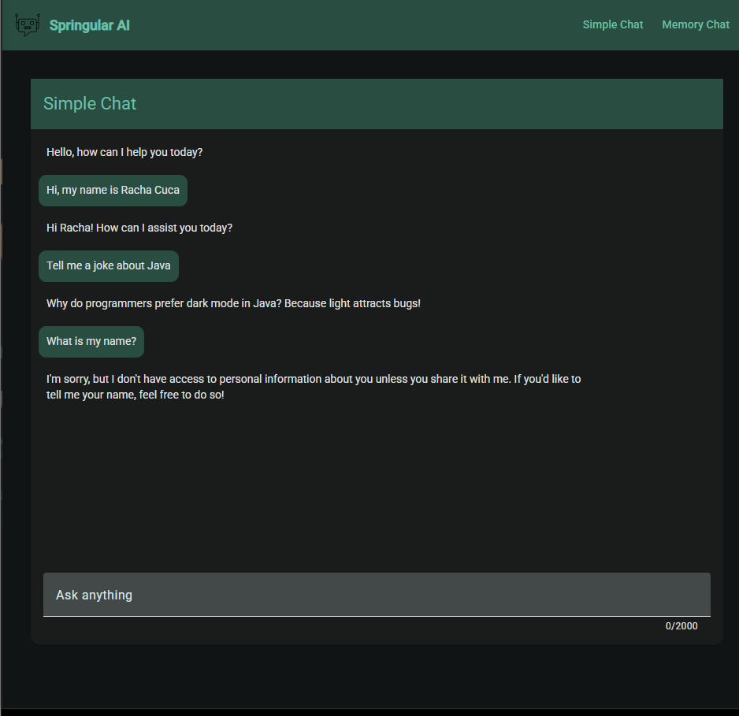
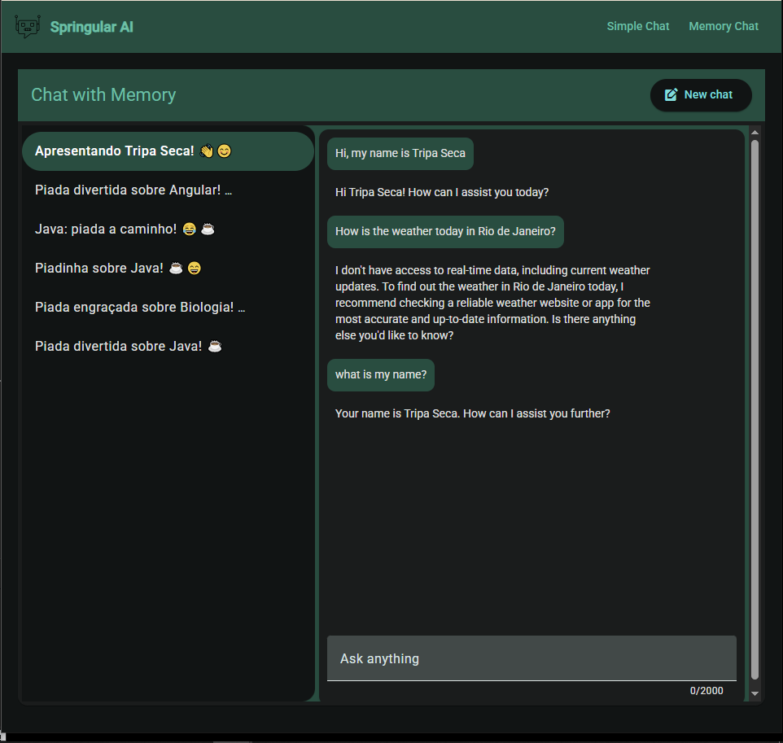

<h1 align="center">
  
  Springular AI
</h1>

<p align="center">
  🌎 <strong>Languages:</strong><br>
  <a href="README.pt.md">🇧🇷 Portuguese</a> |
  <a href="README.md">🇺🇸 English</a>
</p>

**Springular AI** is a full-stack application that demonstrates how to build **AI-powered chat experiences** using **Spring AI (Java)** on the backend and **Angular** on the frontend.

The project includes:
- A **Simple Chat** (stateless interaction with the LLM)
- A **Memory Chat** (conversation history persisted in a database using Spring AI Chat Memory)

It focuses on **clean architecture**, **modern Angular patterns**, and **practical usage of Spring AI** with OpenAI models.

---

## 🏆 Motivation

This project was created as part of a **learning journey based on the Spring AI + Angular playlist** by Loiane Groner:  
👉 https://github.com/loiane/spring-ai-angular

Beyond practicing **full-stack development**, the main motivation was **curiosity and hands-on exploration of how Spring AI works in a real-world scenario**, specifically:

- Understanding how **Spring AI consumes the OpenAI API**
- Building a **real chat application** instead of isolated examples
- Exploring **prompt handling, conversation flow, and chat memory**
- Integrating **Spring Boot (backend)** with **Angular (frontend)** in a clean and modern way

As a Computer Science student, this project also helped reinforce concepts such as:

- Designing REST APIs for conversational systems  
- Managing state and conversation history on the backend  
- Creating a responsive and reactive chat UI with Angular  
- Applying clean architecture and separation of concerns  

Overall, **Springular AI** serves both as a practical study project and a sandbox to experiment with **AI-driven applications using Spring AI and OpenAI** in a realistic full-stack environment.

## 📸 Screenshots

Below are some screenshots showcasing the main features of **Springular AI**.

### 🗨️ Simple Chat
Stateless chat using Spring AI and OpenAI.



### 🧠 Memory Chat
Conversation history is persisted using Spring AI Chat Memory with MySQL.



## 📚 Learning Points

During development, the following concepts were explored and reinforced:

- **Backend**
  - Spring Boot 3
  - Spring AI (ChatClient, Advisors, Chat Memory)
  - OpenAI integration
  - JDBC-based chat memory repository
  - RESTful APIs
  - Clean service and repository layers
  - Docker Compose for local infrastructure

- **Frontend**
  - Angular standalone components
  - Angular Signals and Effects
  - Angular Material UI
  - HTTP resources (`httpResource`)
  - Error handling and retry strategies
  - Chat UI patterns (auto-scroll, typing indicators, validation)

## 🚀 How to Run the Project Locally

Follow the steps below to run everything locally.

### 📦 Prerequisites

Make sure you have the following installed:

- **Java 21+**
- **Node.js 18+**
- **Angular CLI**
- **Docker & Docker Compose**
- **An OpenAI API Key**

---
### 🔐 Environment Variables

The backend requires an OpenAI API key.

Set it in your environment:

```yaml
export OPENAI_API_KEY=your_openai_api_key_here
```
Or on Windows (PowerShell):
```powershell
$env:OPENAI_API_KEY="your_openai_api_key_here"
```
---
### 🐬 Database (MySQL via Docker)
The project uses **MySQL** for chat memory persistence.

From the `backend` folder, start the database:
```bash
docker compose up -d
```
This will start a MySQL container with:
- Database: `mydatabase`
- User: `myuser`
- Password: `secret`
- Port: `3306`

⚠️ The schema is not **auto-created**.
Spring AI chat memory tables must already exist or be managed manually.

---
### 🧠 Backend (Spring Boot + Spring AI)

1. Navigate to the backend folder:
```bash
cd backend
```
2. Run the application:
```bash
./mvnw spring-boot:run
```
3. The backend will start on:
```arduino
http://localhost:8080
```

Available API Endpoints
- Simple Chat
```bash
POST /api/chat
```
- Memory Chat
```http
GET    /api/chat-memory
GET    /api/chat-memory/{chatId}
POST   /api/chat-memory/start
POST   /api/chat-memory/{chatId}
```

For more information, visit: [Spring AI Documentation](https://docs.spring.io/spring-ai/reference/).

---

### 🖥️ Frontend (Angular)

1. Navigate to the frontend folder:
```bash
cd frontend
```

2. Install dependencies:
```bash
npm install
```

3. Start the Angular dev server:
```bash
ng serve
```

4. The frontend will be available at:
```bash
http://localhost:4200
```

The frontend is configured with a proxy to forward `/api/**` requests to the Spring Boot backend.

---

## 🧱 Application Architecture
| Layer    | Technology              | Responsibility                              |
| -------- | ----------------------- | ------------------------------------------- |
| Frontend | Angular + TypeScript    | Chat UI, routing, state management          |
| Backend  | Spring Boot + Spring AI | LLM integration, memory handling, REST APIs |
| Database | MySQL                   | Persistent chat memory                      |
| AI Model | OpenAI                  | Natural language responses                  |
| Infra    | Docker Compose          | Local database setup                        |

## 🧭 Application Flow
```text
User
 ↓
Angular Frontend
 ↓
Spring Boot REST API
 ↓
Spring AI ChatClient
 ↓
OpenAI Model
 ↓
Response returned to UI
```
- For memory chat:
```text
User
 ↓
Angular Frontend
 ↓
Spring Boot REST API
 ↓
Spring AI ChatClient + ChatMemory
 ↓
MySQL (conversation history)
 ↓
OpenAI Model
```

## 📂 Project Structure
```bash
springular-ai/
├─ backend/
│  ├─ src/main/java/com/pitercoding/backend/
│  │  ├─ chat/                 # Stateless chat
│  │  ├─ memory/               # Memory-based chat
│  │  └─ BackendApplication.java
│  ├─ compose.yaml             # MySQL container
│  ├─ pom.xml                  # Spring Boot + Spring AI config
│  └─ application.properties
├─ frontend/
│  ├─ public/                  # Logos and static assets
│  ├─ src/app/
│  │  ├─ chat/                 # Simple Chat & Memory Chat UI
│  │  ├─ shared/               # Pipes, logging, error handling
│  │  └─ app.routes.ts
│  ├─ proxy.conf.js             # API proxy configuration
│  └─ angular.json
├─ README.md
├─ README.pt.md
└─ LICENSE
```

## 📜 License

This project is licensed under the **MIT License** — feel free to use, study, and modify it.

## 🧑‍💻 Author

**Piter Gomes** — Computer Science Student (6th Semester) & Full-Stack Developer

📧 [Email](mailto:piterg.bio@gmail.com) | 💼 [LinkedIn](https://www.linkedin.com/in/piter-gomes-4a39281a1/) | 💻 [GitHub](https://github.com/pitercoding) | 🌐 [Portfolio](https://portfolio-pitergomes.vercel.app/)
